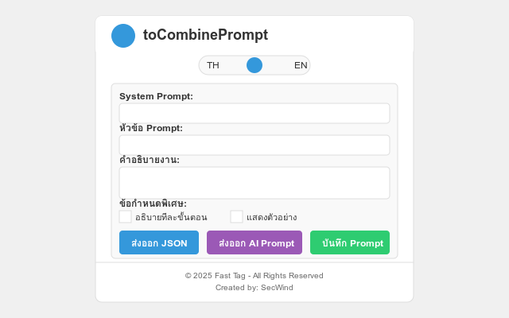
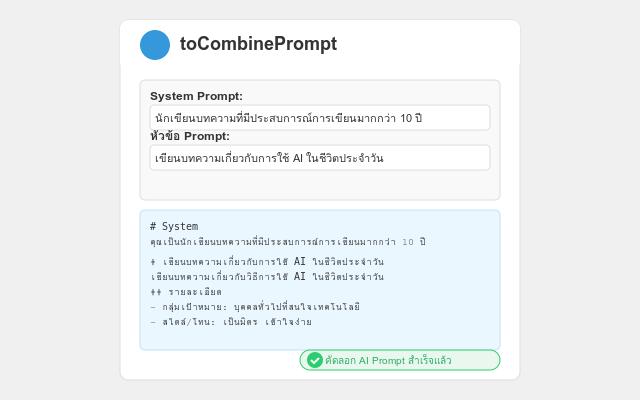
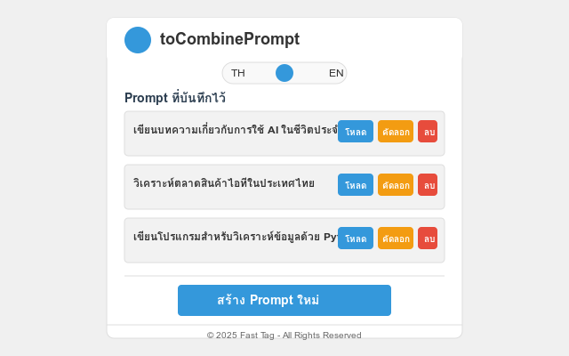

# toCombinePrompt

<p align="center">
  
</p>

<p align="center">
  <strong>สร้างและจัดการ Prompt สำหรับ AI อย่างมีประสิทธิภาพ</strong>
</p>

<p align="center">
  <a href="#คุณสมบัติหลัก">คุณสมบัติหลัก</a> •
  <a href="#วิธีการติดตั้ง">วิธีการติดตั้ง</a> •
  <a href="#วิธีการใช้งาน">วิธีการใช้งาน</a> •
  <a href="#สิทธิ์การเข้าถึง">สิทธิ์การเข้าถึง</a> •
  <a href="#การพัฒนา">การพัฒนา</a> •
  <a href="#นโยบายความเป็นส่วนตัว">ความเป็นส่วนตัว</a> •
  <a href="#ลิขสิทธิ์">ลิขสิทธิ์</a>
</p>

---

## 🌟 ภาพรวม

**toCombinePrompt** เป็น Chrome Extension ที่ออกแบบมาเพื่อช่วยให้คุณสร้าง จัดการ และแชร์ Prompt สำหรับ AI (เช่น ChatGPT, Claude, Gemini) ได้อย่างมีประสิทธิภาพ

รองรับทั้งภาษาไทยและภาษาอังกฤษ ช่วยให้คุณสร้าง Prompt ที่มีโครงสร้างดี มีประสิทธิภาพ และใช้ซ้ำได้ ลดเวลาในการพิมพ์ Prompt เดิมๆ ซ้ำไปซ้ำมา

## ✨ คุณสมบัติหลัก

-   🌐 **รองรับ 2 ภาษา** - ใช้งานได้ทั้งภาษาไทยและภาษาอังกฤษ สลับภาษาได้ง่ายด้วยปุ่ม Toggle
-   🧠 **สร้าง Prompt ที่มีโครงสร้าง** - ช่วยให้คุณสร้าง Prompt ที่มีโครงสร้างชัดเจน ทำให้ AI เข้าใจความต้องการของคุณได้ดีขึ้น
-   💾 **บันทึกและใช้ซ้ำ** - บันทึก Prompt ที่ใช้บ่อยเพื่อใช้ซ้ำในอนาคต โดยไม่ต้องเสียเวลาพิมพ์ใหม่
-   📋 **คัดลอกไปใช้งานได้ทันที** - คัดลอก Prompt ไปยังคลิปบอร์ดในรูปแบบพร้อมใช้งานกับ AI โดยไม่ต้องแก้ไขเพิ่มเติม
-   📱 **ใช้งานง่าย** - อินเตอร์เฟซที่เรียบง่าย เข้าใจได้ทันที
-   🔒 **ให้ความสำคัญกับความเป็นส่วนตัว** - ข้อมูลทั้งหมดถูกเก็บไว้ในเครื่องของคุณเท่านั้น ไม่มีการส่งข้อมูลไปยังเซิร์ฟเวอร์ใดๆ

## 📥 วิธีการติดตั้ง

### วิธีที่ 1: ติดตั้งจาก Chrome Web Store

1. เข้าไปที่ [Chrome Web Store](https://chrome.google.com/webstore/detail/tocombineprompt/xxxxx) (ลิงก์จะพร้อมใช้งานเมื่อ Extension ถูกเผยแพร่)
2. คลิกที่ปุ่ม "เพิ่มลงใน Chrome"
3. ยืนยันการติดตั้ง

### วิธีที่ 2: ติดตั้งในโหมดนักพัฒนา

1. ดาวน์โหลดโค้ดจาก [GitHub Repository](https://github.com/yourusername/tocombineprompt) นี้
2. แตกไฟล์ ZIP (ถ้ามี)
3. เปิด Chrome และไปที่ `chrome://extensions/`
4. เปิดโหมดนักพัฒนา (Developer Mode) ด้านบนขวา
5. คลิกที่ "Load unpacked" และเลือกโฟลเดอร์ที่มีไฟล์ Extension

## 🚀 วิธีการใช้งาน

1. **เปิด Extension** - คลิกที่ไอคอน toCombinePrompt บนแถบเครื่องมือของ Chrome
2. **เลือกภาษา** - เลือกภาษาที่ต้องการใช้งาน (ไทย/อังกฤษ)
3. **สร้าง Prompt**:
    - กำหนด System Prompt (AI ควรเป็นใคร เช่น นักเขียน, ครู, โปรแกรมเมอร์)
    - ระบุหัวข้อและคำอธิบายงาน
    - เพิ่มรายละเอียดเกี่ยวกับกลุ่มเป้าหมาย, รูปแบบผลลัพธ์, สไตล์, ฯลฯ
    - เลือกข้อกำหนดพิเศษตามต้องการ (เช่น อธิบายทีละขั้นตอน, แสดงตัวอย่าง)
4. **ใช้งาน Prompt**:
    - คลิก "ส่งออกเป็น AI Prompt" เพื่อคัดลอก Prompt ในรูปแบบที่พร้อมใช้งาน
    - คลิก "ส่งออกเป็น JSON" เพื่อคัดลอกข้อมูลในรูปแบบ JSON
    - คลิก "บันทึก Prompt" เพื่อเก็บ Prompt ไว้ใช้ในภายหลัง
5. **จัดการ Prompt ที่บันทึกไว้**:
    - โหลด - นำ Prompt กลับมาแก้ไขใหม่
    - คัดลอก - คัดลอก Prompt ไปยังคลิปบอร์ด
    - ลบ - ลบ Prompt ที่ไม่ต้องการ

## 🔐 สิทธิ์การเข้าถึง

Extension นี้ขอสิทธิ์การเข้าถึงดังนี้:

-   `storage` - สำหรับจัดเก็บ Prompts และการตั้งค่าของผู้ใช้ในเครื่อง
-   `clipboardWrite` - สำหรับคัดลอก Prompts ไปยังคลิปบอร์ด

## 🛠️ การพัฒนา

### โครงสร้างไฟล์

```
toCombinePrompt/
├── images/              # ไอคอนและรูปภาพ
├── popup.html          # หน้า UI หลักของ Extension
├── popup.js            # โค้ด JavaScript สำหรับหน้า UI
├── styles.css          # สไตล์ CSS
├── background.js       # Service Worker
├── manifest.json       # ไฟล์ manifest ของ Extension
└── privacy-policy.html # นโยบายความเป็นส่วนตัว
```

### การมีส่วนร่วมในการพัฒนา

1. Fork repository นี้
2. สร้าง branch ใหม่ (`git checkout -b feature/amazing-feature`)
3. Commit การเปลี่ยนแปลงของคุณ (`git commit -m 'Add some amazing feature'`)
4. Push ไปยัง branch (`git push origin feature/amazing-feature`)
5. เปิด Pull Request

## 🔒 นโยบายความเป็นส่วนตัว

Extension นี้ไม่เก็บรวบรวมหรือส่งข้อมูลส่วนบุคคลใดๆ ข้อมูลทั้งหมด (Prompts และการตั้งค่า) จะถูกจัดเก็บเฉพาะในเครื่องของผู้ใช้เท่านั้น โดยใช้ Chrome Storage API

ดูข้อมูลเพิ่มเติมได้ที่ [นโยบายความเป็นส่วนตัว](privacy-policy.html)

## 📝 ลิขสิทธิ์

© 2025 Fast Tag - All Rights Reserved

พัฒนาโดย [SecWind](mailto:secwind.dev@gmail.com)

---

## 📸 ภาพหน้าจอ



_หน้าหลักของ Extension ในโหมดภาษาไทย_


_ตัวอย่างการแสดงผลของ Prompt ที่สร้างขึ้น_

## 📞 ติดต่อ

หากคุณมีคำถาม ข้อเสนอแนะ หรือพบปัญหาการใช้งาน สามารถติดต่อได้ที่:

-   Email: [secwind.dev@gmail.com](mailto:secwind.dev@gmail.com)
-   GitHub: [github.com/secwind-dev](https://github.com/secwind-dev)
-   Facebook: [facebook.com/secwind.dev](https://www.facebook.com/secwind.dev)

---

<p align="center">
  Made with ❤️ in Thailand
</p>
